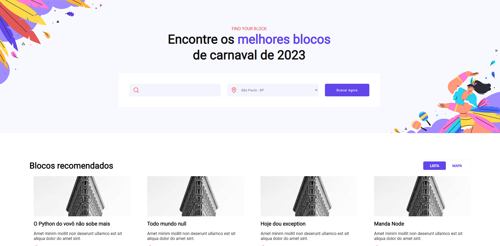

# **Find Your Carnival Block**

Este é um projeto React desenvolvido para ajudar os usuários a encontrar blocos de carnaval em sua cidade. O projeto utiliza styled components para estilização dos componentes, Context API para gerenciamento de estado e o JSON-Server como uma API mock para dados de blocos de carnaval.

## **Instalação e uso**

Para utilizar o projeto em sua máquina local, siga os seguintes passos:

1. Clone o repositório para sua máquina local:

   ```

   git clone https://github.com/crystian97/find-your-carnival-block.git

   ```

2. Instale as dependências do projeto:

   ```

   npm install

   ```

3. Inicie o servidor JSON-Server:

   ```

   npm run dev:server

   ```

4. Inicie o servidor React:

   ```

   npm run dev

   ```

5. Acesse o projeto em seu navegador no endereço **`http://localhost:3000/`**.

## **Licença**

Este projeto está licenciado sob a licença MIT. Consulte o arquivo LICENSE para obter mais informações.
